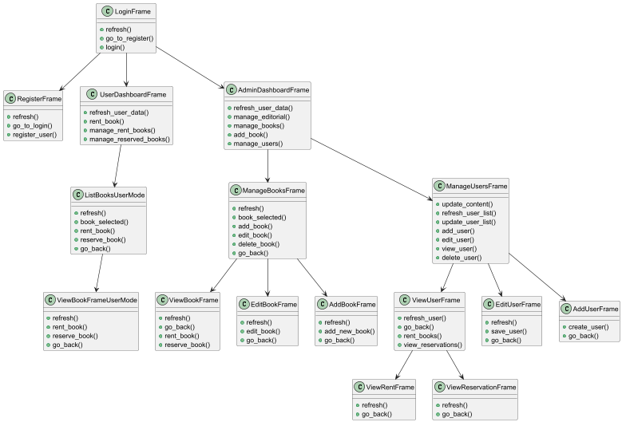
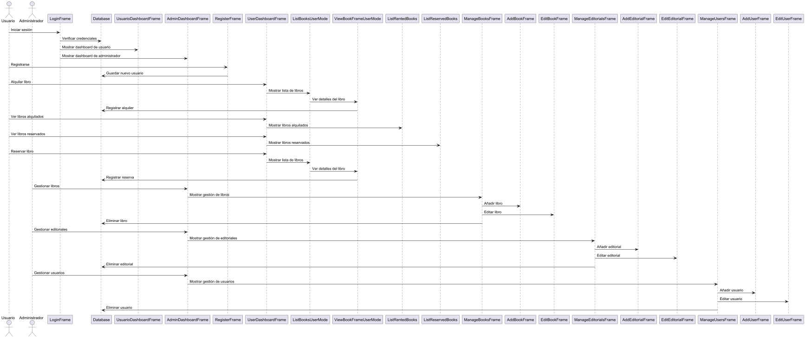

# Projecte de llibreria 
## Asignatura M5 - Python

Aquest projecte és una aplicació de gestió de llibres desenvolupada amb Python i Tkinter. Permet als usuaris registrar-se, iniciar sessió, veure llibres disponibles, llogar llibres, reservar llibres i gestionar els llibres i usuaris si són administradors.

## Diagrama de Classes



El diagrama de classes mostra les diferents classes del projecte i les seves relacions. Cada classe representa una entitat del sistema, com ara `User`, `Book`, `Reservation`, etc. Les línies entre les classes indiquen les relacions entre elles, com ara herència o associació.

## Diagrama Funcional



El diagrama funcional descriu els diferents processos i funcions del sistema. Mostra com les diferents parts del sistema interactuen entre elles per complir amb els requisits funcionals. Aquest diagrama ajuda a entendre el flux de treball i les operacions principals que es poden realitzar dins del sistema.

## Requisits

- Python 3.x
- Llibreria `tkinter`
- Llibreria `mysql-connector-python`
- Fitxer `.env` amb les credencials de la base de dades

## Instal·lació

1. Clona el repositori:
    ```bash
    git clone https://github.com/nom-usuari/nom-repositori.git
    cd nom-repositori
    ```

2. Crea un entorn virtual i activa'l:
    ```bash
    python -m venv env
    source env/bin/activate  # Per a Unix
    .\env\Scripts\activate  # Per a Windows
    ```

3. Instal·la les dependències:
    ```bash
    pip install -r requirements.txt
    ```

4. Crea un fitxer `.env` a l'arrel del projecte amb les següents variables:
    ```env
    DB_NAME=nom_base_de_dades
    DB_USER=usuari
    DB_PASSWORD=contrasenya
    DB_HOST=host
    DB_PORT=port
    ```

## Ús

1. Executa l'aplicació:
    ```bash
    python main.py
    ```

2. Inicia sessió amb un usuari existent o registra't com a nou usuari.

3. Si ets administrador, podràs gestionar editorials, llibres i usuaris.

## Estructura del projecte

- `main.py`: Punt d'entrada de l'aplicació.
- `classes/`: Conté totes les classes utilitzades en l'aplicació.
  - `admin_dashboard.py`: Marc per a la gestió d'administradors.
  - `books.py`: Classes per a la gestió de llibres.
  - `constants.py`: Constants utilitzades en l'aplicació.
  - `database.py`: Connexió a la base de dades.
  - `login.py`: Marc per a l'inici de sessió.
  - `register.py`: Marc per al registre d'usuaris.
  - `user.py`: Classes per a la gestió d'usuaris.
  - `user_dashboard.py`: Marc per a la gestió d'usuaris.

## Contribució

1. Fes un fork del repositori.
2. Crea una branca per a la teva característica (`git checkout -b característica/nova-característica`).
3. Fes commit dels teus canvis (`git commit -am 'Afegeix nova característica'`).
4. Puja la branca (`git push origin característica/nova-característica`).
5. Obre una sol·licitud de pull.

## Llicència

Aquest projecte està sota la llicència MIT. Veure el fitxer `LICENSE` per a més detalls.